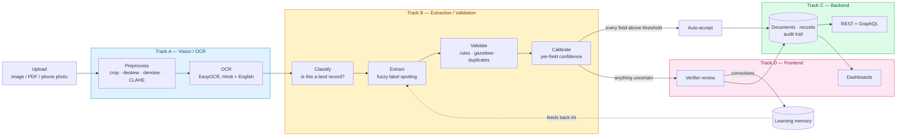
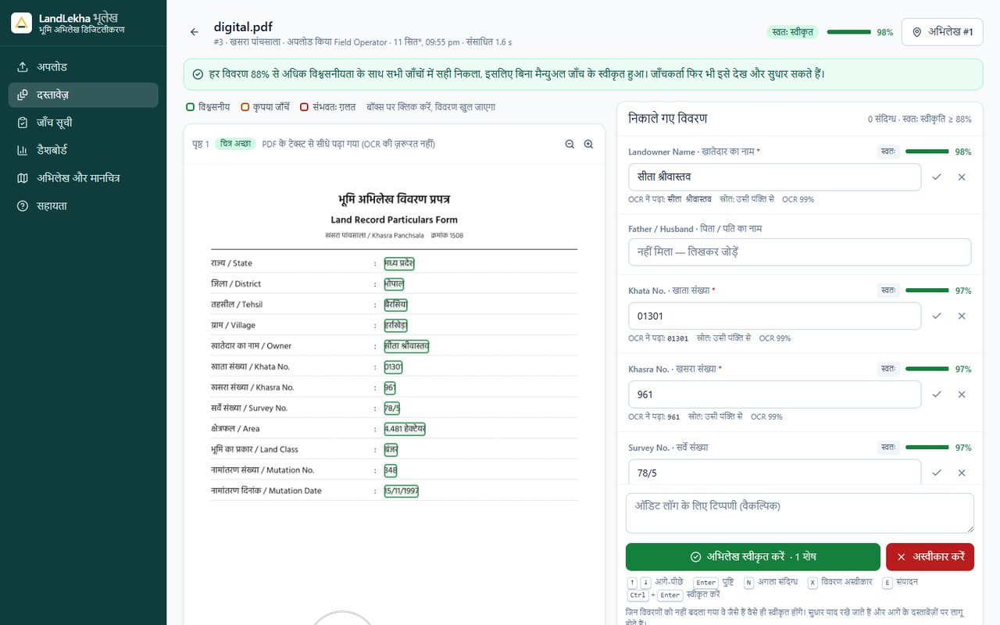

<h1 align="center">LandLekha</h1>
<p align="center"><b>AI-powered land record digitization and validation</b> — Smart India Hackathon 2026 · Problem Statement 26018 · Department of Land Resources, Ministry of Rural Development</p>

<p align="center">
  <a href="https://github.com/Rayyan-mohammed/Land-Lekha/actions/workflows/ci.yml"></a>
  <a href="LICENSE"></a>
  
  
  
  
</p>

---

### Live Demo

🔗 **[http://65.2.234.77:8000](http://65.2.234.77:8000)** — AWS EC2 (t3.medium, ap-south-1), Docker Compose, encrypted root volume, Elastic IP (survives reboots). Demo accounts: `operator`/`upload@123`, `verifier`/`verify@123`, `admin`/`admin@123` (see "Run it" below — change these outside a demo). API docs at [/docs](http://65.2.234.77:8000/docs); GraphQL at `/api/graphql`.

Some networks (e.g. certain institutional/campus proxies) block raw `*.amazonaws.com` hostnames but allow IPs — if the link above doesn't load, try `http://ec2-65-2-234-77.ap-south-1.compute.amazonaws.com:8000` instead, or a different network.

---

## What it does

LandLekha takes a scanned or photographed Indian land record — printed or handwritten, Hindi or English — and turns it into structured, validated data: owner, khata, khasra, survey number, area, land class, village, tehsil, district, mutation and registration details, plus every co-owner and parcel row under a khata. Every field gets a confidence score calibrated on held-out data, not a raw OCR score. Confident records are accepted with no human involved; uncertain fields go to a verifier who sees the scan and the machine's answer side by side and checks only what's flagged. **Of the fields the system chooses not to flag, 96.4% are correct** — measured on 40 documents the confidence model never saw during calibration.

> **Status**: working prototype, built over 3 days (2026-09-11 to 2026-09-13) by a 6-person team on one shared `main` branch. The full pipeline — upload, OCR, extraction, validation, calibrated routing, human review, tamper-evident audit trail, REST + GraphQL APIs — is implemented and exercised by 82 backend tests and 34 frontend tests, both suites green in CI as of the latest push. Measured on 110 synthetic documents across three splits, built from the real Ministry of Panchayati Raj village directory. **Not yet measured on a single real land record** — `data/real/` and an in-app upload tool exist for exactly this, but as of this writing nothing has been added to it.

---

## Architecture



The loop is the point: an auto-accepted record and a verifier-approved one land in the same database indistinguishably, but every correction a verifier makes feeds back into Track B's extraction step through the learning memory — so the field that was misread today is read correctly the next time the same mistake would have happened, with no retraining and no person in the loop for it.

---

## The problem

Land records — Khatauni, Khasra Panchsala, Jamabandi, Khatiyan, depending on the state — exist as handwritten or printed registers, and digitizing them today means retyping them by hand: slow, and error-prone in exactly the fields that determine legal ownership, where a mistyped khasra number or an extra zero in a khata number misattributes a parcel. Running OCR alone doesn't fix this: for Devanagari text, **correct OCR output routinely carries a raw model confidence of only 0.4–0.6** (`eval/results/experiments.md`), indistinguishable at a glance from wrong output — so a system that just displays OCR text still needs a human to check every field, which is no faster than typing it in the first place. The problem worth solving isn't reading the page; it's knowing which of the words it read are safe to trust without a second pair of eyes.

---

## How it works

| Layer | What it does |
| --- | --- |
| Upload | Accepts PNG / JPG / TIFF / PDF up to 20 MB and 60 megapixels; a born-digital PDF is read straight from its embedded text layer in about 0.5 s, no OCR at all |
| Preprocess | OpenCV: page crop, illumination flattening, deskew, denoise, CLAHE contrast; a page photographed sideways or upside down is turned upright automatically |
| Classify | A rule ensemble decides whether the page is a land record at all, from several kinds of evidence, **before** a single field is extracted |
| OCR | EasyOCR reads Hindi and English in one pass; a page that reads badly is read again with lighter denoising, and numbers the model is unsure of are re-read by an English-only recognizer that can't confuse Devanagari digits with Latin ones |
| Extract | Fuzzy label-spotting finds 15 fields — same line, beside the label, or inside a table cell — plus every co-owner and every parcel row under one khata |
| Validate | Per-field format rules, a master gazetteer (state → district → tehsil → village) with hierarchy checks, and duplicate detection on parcel/account and exact file hash |
| Confidence | A logistic model, fitted on a held-out split, scores each field from OCR / rule / label / source evidence; routing splits at a threshold tuned to a stated precision target, not to maximize auto-accept rate |
| Review | A verifier sees the cleaned scan with a confidence-coloured box on every field, next to the extracted value and *why* it was flagged; confirm, correct or reject; unsaved corrections survive a reload |
| Learn | A correction is remembered and re-applied the next time the same misreading would happen; fields that get corrected often have their threshold raised automatically |
| Audit | Every action - upload, decision, correction, dispute - is logged and hash-chained to the entry before it, so an edit or deletion afterward is detectable |
| Serve | REST and GraphQL over the same access rules; mock LRMS exchange format, DILRMP progress report, GeoJSON parcels for a map |

---

## What maps to the problem statement

| PS 26018 asks for | In LandLekha |
| --- | --- |
| Is it a land document at all? | Decided **before** any field is extracted, from several *kinds* of evidence on the page (parcel identifier, extent, tenure, revenue office, land use, boundaries, transaction) - never one keyword. Measured on 115 real OCR readings: **105 of 105 readable land pages kept, 10 of 10 readable non-land pages refused, 0 mistakes**. A non-land page ends as *NOT A LAND DOCUMENT* with no fields; government wording is reported as an *indicator*, never proof of authenticity |
| Multilingual recognition | Hindi (Devanagari) + English, in one model; Devanagari digits; the scripts on each page are detected and reported, never translated |
| Extraction from scans, PDFs, images | PNG/JPG/TIFF/PDF upload, phone camera capture, multi-page PDFs. Born-digital PDFs read from their text layer (0.5 s, exact). Sideways/upside-down photos turned upright automatically. Every page gets a quality verdict with retake advice |
| Classification into predefined fields | 15 fields (`backend/extraction/schema.py`), found in key:value forms, filled forms and Khatauni tables; every co-owner and parcel row under a khata |
| Validation: business rules, cross-database, duplicates | Format rules per field, master gazetteer (state → district → tehsil → village) with hierarchy checks, duplicate detection on parcel/account + exact-file hash |
| Confidence scoring, uncertain fields flagged | Logistic calibration over OCR, rule, label and source evidence; per-field threshold |
| Human-assisted verification | Side-by-side review screen, confirm/correct/reject per field; a verified document can be reopened for a second look (dispute flow), logged to the same audit trail as an approval |
| Learning that improves over time | Verifier corrections are remembered and re-applied; proven end to end by `tests/test_api.py::test_a_correction_is_carried_over_to_the_next_document` |
| LRMS / DILRMP / GIS / cadastral integration | Documented REST + GraphQL endpoints: LRMS exchange format + push, DILRMP progress report, GeoJSON parcels on a Leaflet map, a live digitization progress map (external systems simulated) |
| Secure repository, metadata, audit trail | Stored originals + SHA-256, hash-chained audit log with a verify endpoint, login rate-limiting |
| Dashboards | Processed count, auto-accept rate, accuracy, state/district progress on a live map, estimated time saved, CSV export for BI tools |
| Notifications | Pluggable service (email/webhook); console-only until a real provider is configured |
| APIs | FastAPI with OpenAPI docs at `/docs`, plus GraphQL at `/api/graphql` |
| Role-based access | JWT; operator/verifier/admin enforced on every endpoint |
| Usability and accessibility | Hindi and English everywhere, enforced by a test that fails the build otherwise; axe audit, 0 violations, 11 screens; read-aloud and kiosk QR scan for citizens on the public verify page |

---

## Screens

Every screen works in Hindi and English with one click. The printed extract and the public QR check are always bilingual.

| | |
| --- | --- |
|  |  |
| **Sign-in**: one-click demo accounts, Hindi/English switch | **Review**: confidence-coloured boxes on the scan, next to the extracted values |
|  |  |
| **Dashboard**: what waits for a person, accuracy, state/district progress | **Records & GIS**: LRMS format, co-owners, parcel map, DILRMP report |
|  |  |
| **Verified extract**: bilingual, tamper-evident fingerprint and QR code | **Public check**: anyone scanning the QR sees whether the paper still matches the record |

**हिंदी में (in Hindi)** — the same review screen after one click on the language switch:



---

## Results

### 1. Field extraction accuracy on held-out data

Measured on 40 documents (`test` split) the confidence model never saw during fitting; reproduce with `python eval/evaluate.py --split test` ([full table](eval/results/test.md)).

| Metric | Held-out test | Dev (tuning split) |
| --- | --- | --- |
| Field accuracy (15 fields) | **88.1%** | 87.6% |
| Required-field accuracy | 87.5% | 87.5% |
| Character error rate (median) | 10.9% | 12.1% |
| Fields flagged for a human | **15.3%** | 21.3% |
| Precision of fields *not* flagged | **96.4%** | 96.4% |
| Documents needing a human look | 67.5% | 75.0% |


> **Honest scope**: the threshold sits in the *middle* of the range that meets a 95% precision target on dev, not at its lowest edge — the lowest edge met the target on dev and missed it on test. Both splits are synthetic, generated from real LGD village names but not real handwriting or real paper. Full methodology and the experiments that didn't work: [docs/usps.md](docs/usps.md), [eval/results/experiments.md](eval/results/experiments.md).

### 2. The land-document classifier

A rule ensemble decides whether a page is a land record before any field is extracted, measured on 115 real OCR readings (105 land pages, 10 deliberately not) — [eval/results/classification.md](eval/results/classification.md).

| | called land | called not land |
| --- | --- | --- |
| land page | 105 | 0 |
| not a land page | 0 | 10 |

**100% accuracy, precision and recall** on this set. A bank statement or an electricity bill photographed by mistake never reaches the register with a fabricated khasra number.

> **Honest scope**: the non-land set is 14 pages, small and synthetic. This shows the mechanism works, not that it holds up against the full variety of paper a real office would see it.

### 3. Phone-photo quality gate

Across all 17 phone photos in the three evaluation splits, a pre-OCR check separates readable pages from unreadable ones before anything is extracted.

| Phone photos | Documents | Mean field accuracy | Range |
| --- | --- | --- | --- |
| accepted by the quality check | 12 | **84.3%** | 63.6% – 100% |
| sent back for a retake | 5 | 10.4% | 0% – 21.4% |

The two groups do not overlap — the worst page it kept (63.6%) still beat the best page it rejected (21.4%).

> **Honest scope**: phone photos remain the weakest input overall (56.5% field accuracy including the rejected ones). The underlying recognition problem needs fine-tuning on real field photos; the quality gate is a speed/UX fix, not an accuracy fix. See the "Honest limitations" section below.

### 4. Multi-owner, multi-parcel Khatauni support

A separate 30-document split with 1–3 co-owners and 1–4 parcel rows per khata, on real LGD villages — [eval/results/multi.md](eval/results/multi.md).

| Metric | Value |
| --- | --- |
| Field accuracy | 85.2% |
| Every co-owner found (multi-owner documents) | 3 of 6 |
| Parcel rows recovered in multi-row tables | 16 of 23 |
| Documents needing a human look | 86.7% |

> **Honest scope**: this is the hardest split and the one where unflagged fields are least reliable (94.3% vs. 96.4% overall). The co-owner match is all-or-nothing per document over only 6 multi-owner documents, so one wrong split (OCR reading the connector "एवं" as "एव" or "एच") moves the number by double digits.

---

## Honest limitations

- **The data is entirely synthetic.** No public labelled dataset of Indian land records exists, so every number above comes from a generator (`data/generator/`), not a real register. An in-app tool (`/real-samples`, admin-only) exists to change this, but nothing has been uploaded through it yet.
- **Phone photos are the weakest input** (56.5% field accuracy), and the reason is a recognition-model limitation, not something more preprocessing fixes — real-photo fine-tuning is the actual lever.
- **About half the remaining field errors are a confidently-wrong reading** (`1805/1` read as `1305/1` at 0.95 confidence), which no amount of re-reading corrects.
- **Master data covers 6 states and 71 districts**: Uttar Pradesh, Madhya Pradesh, Rajasthan and Bihar (4/2/2/2 districts, a 2022 LGD CSV mirror), plus Andhra Pradesh and Telangana (28/33 districts, downloaded directly from lgdirectory.gov.in). Village English names and LGD codes are real everywhere. Local-script names differ by source: for the four Devanagari states, Hindi spellings are **algorithmically transliterated and not verified** by a native speaker (`backend/extraction/transliterate.py`); for Andhra Pradesh and Telangana, Telugu names are the **real values from the LGD download itself**, left blank rather than guessed wherever the source had none (coverage is complete for Telangana, partial for Andhra Pradesh — district ~54%, tehsil ~7%, village ~2%; see `gazetteer.json`'s `_note`). `build_gazetteer.py` only ever touches the Devanagari-script states, so it can't overwrite the real Telugu data with wrong-script transliteration.
- **LRMS / DILRMP / GIS integration is real, documented APIs against simulated government systems** — there is no real endpoint to test against.
- **The estimated "time saved" figure on the dashboard is a stated assumption** (8 minutes of manual entry per record), not a measurement, and is counted only against fully auto-accepted documents specifically so it understates rather than overclaims.
- **Read-aloud (browser text-to-speech) and the kiosk QR camera scan are untested with real audio and a real camera.** Both pass their automated checks; neither has been confirmed by a person actually listening or scanning, because the environment they were built in had no capable browser.
- **Speed** is 30–60 s per scanned page on a CPU laptop (1–2 s on a GPU, 0.5 s for born-digital PDFs) — above a 10 s target on the hardware this was built on.
- **Scaling** is single-worker per process; the queue is now database-backed so multiple API replicas can share one Postgres database (`docker-compose.yml`), but this hasn't been load-tested beyond the concurrency unit tests.
- **Cursive handwriting** is out of scope; only legible handwritten form entries are supported.

---

## Repository structure

```
backend/
  ocr/            # Track A: OpenCV preprocessing, EasyOCR wrapper, the run_ocr() pipeline
  extraction/     # Track B: label-spotting, parsers/validators, gazetteer, confidence, learning
  classify/       # is-this-a-land-record rule ensemble, runs before extraction
  api/            # Track C: FastAPI app, SQLAlchemy models, auth/RBAC, audit, worker queue, routes
frontend/         # Track D: React 19 + Tailwind, upload/review/dashboard/records/audit/users screens
data/
  generator/      # synthetic Khatauni/Khasra/Jamabandi/Khatiyan document generator (Playwright)
  demo/           # 9 committed sample files + expected answers, for a live demo with no generator run
  real/           # real, redacted documents go here (currently empty - see Honest limitations)
eval/             # CER/field-accuracy evaluation, confidence calibration, A/B experiment harness
docs/             # data contracts between tracks, USPs, demo script, team plan
tests/            # backend unit + integration tests (pytest)
scripts/          # one-command start/setup scripts, the accessibility audit runner
datasets/non_land/ # small synthetic non-land page set used to measure the classifier
```

---

## Quick start

The fastest path to a real result, no OCR model download and no server needed - the extraction and validation logic against synthetic OCR output, in seconds:

```bash
pip install -r backend/requirements.txt
python -m pytest tests -q          # ~82 tests, no OCR model, a few seconds
```

To see the whole pipeline end to end:

```bash
pip install -r backend/requirements.txt
python -m uvicorn backend.api.main:app --port 8000   # API + docs at :8000/docs

cd frontend && npm install && npm run dev              # UI at :5173
```

The first start downloads the EasyOCR models (~100 MB) - the only external dependency, and it's a one-time download, not a cloud account. Demo accounts are seeded on first start (disable with `LL_SEED_DEMO_USERS=0`):

| User | Password | Can |
| --- | --- | --- |
| `operator` | `upload@123` | upload, see own documents |
| `verifier` | `verify@123` | + review queue, verify, dispute, push to LRMS, dashboard |
| `admin` | `admin@123` | + users, full audit trail, re-run processing, real-sample uploads |

Sign in as `operator` and drop in a file from `data/demo/` — 9 committed sample files with expected answers in `data/demo/expected.md`, so there's something to try with no dataset generation needed.

---

## Reproduce everything else

```bash
# --- local dev, single command ---
powershell -ExecutionPolicy Bypass -File scripts\start.ps1 -Fresh   # Windows; scripts/start.sh elsewhere
# -Fresh wipes storage/ first for an empty database; -Built serves the built UI from :8000

# --- generate the synthetic dataset and reproduce the measured numbers ---
python data/generator/generate.py --count 40 --split dev  --seed 1
python data/generator/generate.py --count 40 --split test --seed 2
python data/generator/generate.py --count 30 --split multi --seed 5
python eval/evaluate.py --split dev         # runs OCR once, caches it, measures
python eval/calibrate.py --split dev        # fits the confidence model + threshold
python eval/evaluate.py --split test        # the held-out report

# --- frontend checks ---
cd frontend && npm test                     # unit tests; fails the build if any UI string lacks Hindi
python scripts/a11y_check.py                # axe accessibility audit, every screen, both languages (app running)

# --- production / cloud, Postgres + built UI in one container ---
echo "LL_JWT_SECRET=$(openssl rand -hex 32)" > .env
echo "POSTGRES_PASSWORD=$(openssl rand -hex 16)" >> .env
docker compose up --build -d
# scale horizontally once on Postgres (not the SQLite default): docker compose up --scale api=3
```

Full cloud provisioning steps (EC2 setup, security group, Elastic IP, encryption-at-rest,
redeploy/restart commands) are in [DEPLOYMENT.md](DEPLOYMENT.md) — that's what actually
produced the [live demo](#live-demo) above.

---

## Operational safety

**Resetting to a clean state before a demo**: `scripts\start.ps1 -Fresh` (or `start.sh -Fresh`) deletes `storage/` — the SQLite database, uploaded originals, and OCR cache — before starting, so a demo never runs against yesterday's documents or a locked-out rate-limit state. There's no soft-delete or undo for this; it's meant to be run against a disposable local database, not the one behind a real deployment.

**Resource-exhaustion guards on upload**: a file is rejected above 20 MB (`LL_MAX_UPLOAD_MB`) or, after decoding, above 60 megapixels (`LL_MAX_IMAGE_PIXELS`) — a small, heavily-compressed image can otherwise decode into billions of pixels and take down the single OCR worker thread trying to allocate that array. Both limits are environment variables, not constants, so a deployment can tune them without a code change.

**Login throttling**: repeated failed logins for one username lock out that username (including the correct password) for a cooldown window, backed by a database table rather than in-process memory — so the throttle holds even behind multiple API replicas sharing one Postgres database.

---

## Roadmap

Built by a 6-person team across 3 days on one shared `main` branch (241 commits total, 2026-09-11 to 2026-09-13). Checkmarks are for what's actually merged and tested, not planned.

| Phase | Vision / OCR | Extraction / Validation | Backend | Frontend |
| --- | --- | --- | --- | --- |
| **Day 1** — foundation (2026-09-11, 81 commits) | ✅ Preprocessing pipeline, EasyOCR wrapper | ✅ Field schema, label-spotting, first parsers | ✅ FastAPI skeleton, auth, models, worker queue | ✅ Upload, review, dashboard screens |
| **Day 2** — hardening (2026-09-12, 151 commits) | ✅ Second-read retry, English-only number re-read, sideways/upside-down detection | ✅ Multi-owner/parcel support, LGD master data, land-document classifier, confidence calibration | ✅ Audit hash-chain, rate limiting, GraphQL, CSV export, CI | ✅ Hindi/English toggle, accessibility pass, GIS map |
| **Day 3** — citizen-facing (2026-09-13, 9 commits) | ⬜ GPU path (needs hardware nobody has) | ⬜ Real documents in `data/real/` (tooling done, data not) | ✅ Dispute/re-verification flow, real-sample upload endpoint | ✅ Digitization map, read-aloud, kiosk QR scan, time-saved stat |
| **Next** | Fine-tune on real field photos | Populate `data/real/`, expand the non-land test set | WhatsApp/SMS notification provider | Verify read-aloud and kiosk scan with real hardware |

---

## Authors

Six people, one shared `main` branch, no feature branches (see `GIT_RULES.md` for why — a hackathon judging requirement that only human contributors appear in the repository's history).

- **Rayyan Mohammed** ([@Rayyan-mohammed](https://github.com/Rayyan-mohammed)) — repository owner; backend/API track, deployment (`Dockerfile`, `docker-compose.yml`), documentation
- **Ashi Sharma** ([@Ashi-run](https://github.com/Ashi-run)) — frontend, with backend and dataset contributions
- **Kuchuru Sai Krishna Reddy** ([@krishna-2-005](https://github.com/krishna-2-005)) — broad contributor across frontend, backend, evaluation, and the synthetic dataset generator
- **Makkena Lahari** ([@lahari-66](https://github.com/lahari-66)) — frontend, with backend and evaluation contributions
- **Mounika Reddy** ([@Mounika-Reddy-0802](https://github.com/Mounika-Reddy-0802)) — frontend, with backend and evaluation contributions
- **Vikram** ([@Vikram5002](https://github.com/Vikram5002)) — frontend and evaluation, with documentation contributions

> A precise, verified per-person breakdown of which specific feature each person built does not exist beyond `docs/team-plan.md`'s **track**-level assignment (by laptop, not by name) - the areas above are derived from which directories each person's commits actually touched, not a claimed specialization.

---

## Documentation index

- [docs/usps.md](docs/usps.md) — what's actually different here, with the measured number behind each claim
- [docs/contracts.md](docs/contracts.md) — the data contract each track hands to the next (OCR → extraction → API → UI)
- [docs/demo-script.md](docs/demo-script.md) — the timed live-demo walkthrough, including honest answers to likely judge questions
- [docs/team-plan.md](docs/team-plan.md) — the original 3-laptop parallel-work plan and task board
- [DEPLOYMENT.md](DEPLOYMENT.md) — how the live demo is actually hosted: EC2 setup, security group, Elastic IP, encryption at rest, redeploy commands
- [eval/results/experiments.md](eval/results/experiments.md) — 13 OCR experiments, each adopted or rejected with its number
- [eval/results/](eval/results/) — the raw measured output behind every number in this file
- [data/real/README.md](data/real/README.md) — the format for adding a real, redacted document
- [GIT_RULES.md](GIT_RULES.md) — why there's no AI attribution in this repository's history, and who the six allowed identities are
