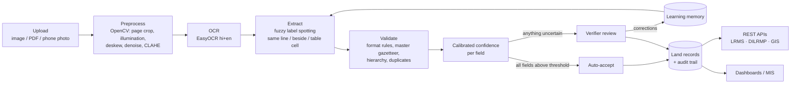
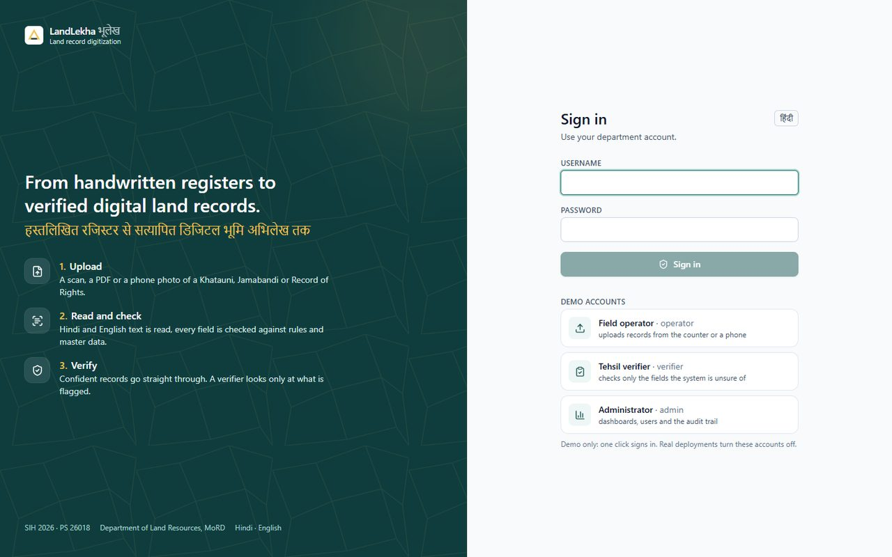
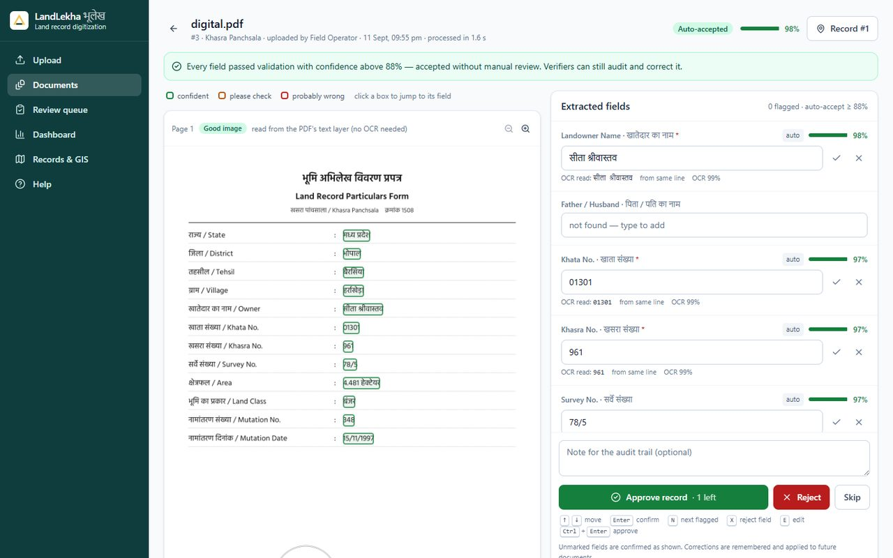
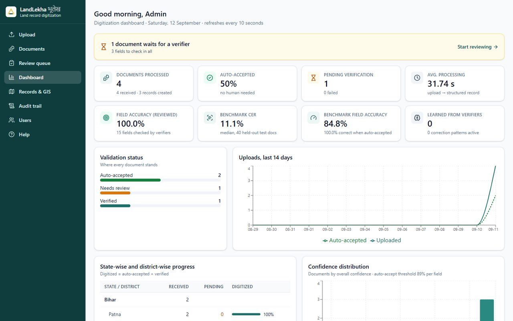
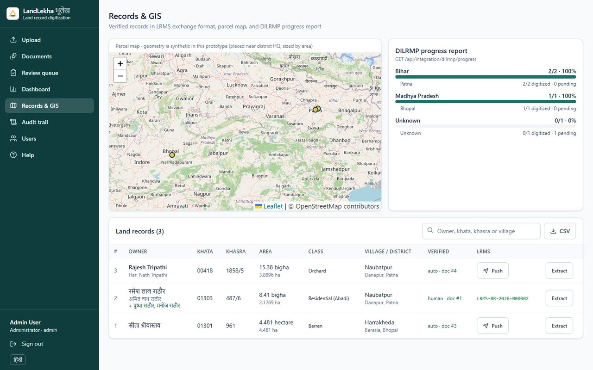
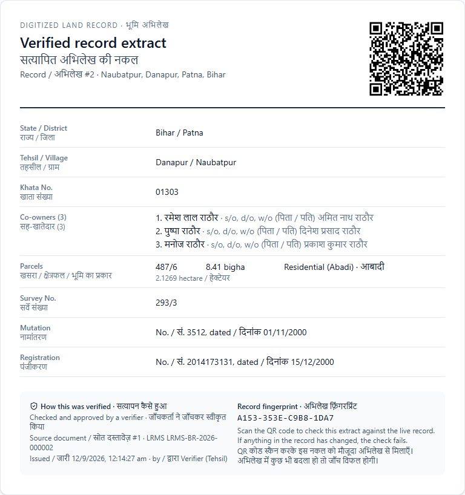
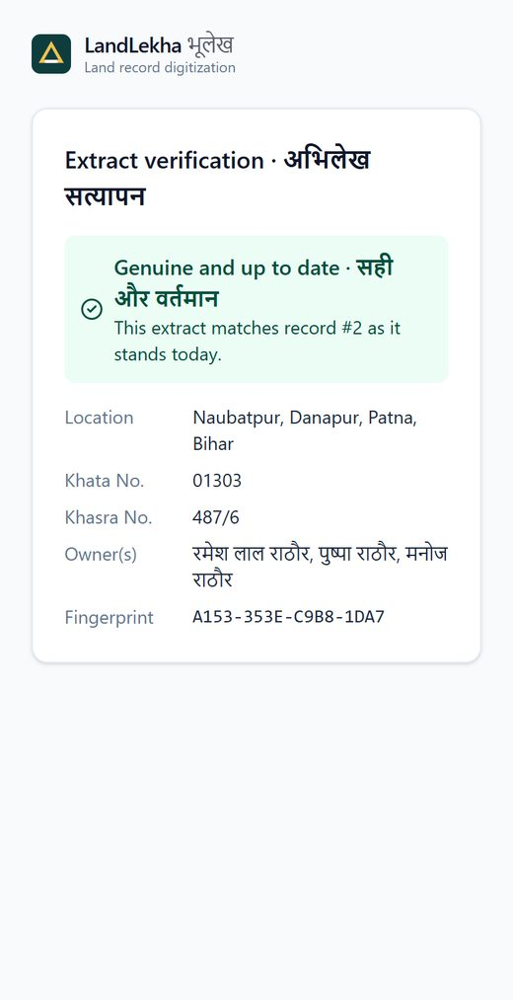

# LandLekha

**AI-powered land record digitization and validation.** SIH 2026 · PS 26018 · Department of Land Resources, Ministry of Rural Development.

LandLekha takes a scanned or photographed land record (printed or handwritten, Hindi or English) and turns it into structured, validated data: owner, khata, khasra, survey number, area, land class, village, tehsil, district, mutation and registration details. Every field gets a calibrated confidence score. Confident records are accepted automatically; uncertain fields go to a verifier, who sees the scan and the machine's answer side by side and only checks what is flagged.



## Results

Measured on 40 **held-out** synthetic documents (`test` split) whose places come from the official LGD village directory. The confidence model and threshold (95% target precision) were fitted on a separate `dev` split. Reproduce with `python eval/evaluate.py --split test`; the full table is in [eval/results/test.md](eval/results/test.md).

| Metric | Held-out test | Dev (tuning split) |
| --- | --- | --- |
| Field accuracy (all 15 fields) | **84.4%** | 83.0% |
| Required-field accuracy | 83.6% | 81.1% |
| Character error rate, median / mean | 11.1% / 15.7% | 12.1% / 16.3% |
| Fields flagged for a human | **21.8%** | 30.2% |
| Precision of fields *not* flagged | **96.2%** | 97.0% |
| Auto-accepted documents with every required field correct | **100%** (3 of 3) | 100% (5 of 5) |
| Documents needing a human look | 92.5% | 87.5% |

By document type (test): English Record of Rights 94.6%, clean pages 97.2%, old faded paper 94.4%, scanner-quality pages 85.9%, Khatauni tables 82.4%, handwritten entries 67.7%, **phone photos 43.9%** (the weakest case). For photos the text is located correctly but the recogniser can't read blurred strokes. Rather than guess, the page quality check tells the operator to retake the photo.

Two things to read from this. First, the verifier checks about 1 field in 5 rather than retyping the page, and the fields left unflagged are right about 96% of the time. Second, the test split is the honest number: the label rules were tuned by looking at dev errors, and test was run once for this report (it came out slightly easier than dev, with fewer multi-owner Khataunis). OCR changes are A/B-tested before adoption; the ones that didn't help are written up in [eval/results/experiments.md](eval/results/experiments.md).

**Multi-owner Khataunis** (separate 30-document split with 1–3 co-owners and 1–4 parcel rows per khata; [eval/results/multi.md](eval/results/multi.md)): every co-owner found on 5 of 7 multi-owner documents, 11 of 18 parcel rows in multi-row tables recovered. OCR often reads the connector एवं ("and") as `एव` or `एच`; the splitter accepts both, while a real name initial like `एच.` is left alone.

The documents are deliberately hard: about 60% are degraded (faded/stained paper, scanner noise and skew, phone photos with perspective and uneven light), and some have handwritten entries or Devanagari digits. CER counts every character on the page, including stamps and footers, so it's a pessimistic number.

## Screens

Every screen works in Hindi and English (one click in the sidebar): labels, review reasons, photo advice, the audit trail and dates. The printed extract and the public QR check are always bilingual.

| | |
| --- | --- |
|  |  |
| **Sign-in**: how it works in three steps, one-click demo accounts, Hindi / English switch | **Review**: boxes coloured by confidence on the cleaned scan; confirm, correct or reject with the keyboard |
|  |  |
| **Dashboard**: what waits for a person, accuracy, state/district progress | **Records & GIS**: LRMS format, co-owners, parcel map, DILRMP report, CSV download |
|  |  |
| **Verified extract**: printable and bilingual, with a tamper-evident fingerprint and QR code | **Public check**: anyone scanning the QR sees, in English and Hindi, whether the paper still matches the record |

## What maps to the problem statement

| PS 26018 asks for | In LandLekha |
| --- | --- |
| Multilingual recognition | Hindi (Devanagari) + English, in one model; Devanagari digits; bilingual labels |
| Extraction from scans, PDFs, images | PNG/JPG/TIFF/PDF upload, phone camera capture, multi-page PDFs. Born-digital PDFs are read from their text layer (0.5 s, exact). Pages photographed sideways or upside down are turned automatically (18/18 test pages recovered). Each page gets a quality verdict with retake advice |
| Classification into predefined fields | 15 fields (`backend/extraction/schema.py`), found in key:value forms, filled forms and Khatauni tables; every co-owner and parcel row under a khata (`owners` / `parcels` lists) |
| Validation: business rules, cross-database, duplicates | Format rules per field, master gazetteer (state → district → tehsil → village) with hierarchy checks, duplicate detection on parcel/account + exact-file hash |
| Confidence scoring, uncertain fields flagged | Logistic calibration over OCR, rule, label and source evidence; per-field threshold |
| Human-assisted verification | Side-by-side review screen, confirm / correct / reject per field, lowest-confidence-first queue |
| Learning that improves over time | Verifier corrections are remembered and re-applied; fields that are corrected often get stricter thresholds |
| LRMS / DILRMP / GIS / cadastral integration | Documented REST endpoints: LRMS exchange format + push, DILRMP progress report, GeoJSON parcels on a Leaflet map (external systems simulated) |
| Secure repository, metadata, audit trail | Stored originals + SHA-256, per-document metadata, append-only audit log of every action |
| Dashboards | Processed count, auto-accept rate, accuracy, validation status, pending cases, error statistics, state/district progress |
| APIs | FastAPI with OpenAPI docs at `/docs` |
| Role-based access | JWT; operator / verifier / admin enforced on every endpoint |

## Run it

Requires Python 3.11+ and Node 18+.

```bash
pip install -r backend/requirements.txt
python -m uvicorn backend.api.main:app --port 8000        # API + docs at http://localhost:8000/docs

cd frontend && npm install && npm run dev                  # UI at http://localhost:5173
```

The first start downloads the EasyOCR models (about 100 MB). For a single-port demo, run `npm run build` in `frontend/`; the API then serves the UI at http://localhost:8000.

Or start everything with one command: `scripts\start.ps1` on Windows (`powershell -ExecutionPolicy Bypass -File scripts\start.ps1`), or `scripts/start.sh` elsewhere. Add `-Fresh` / `--fresh` for an empty database before a demo, and `-Built` / `--built` to serve the built UI from port 8000.

Keep the project **outside** a OneDrive/Dropbox-synced folder if you can. Sync clients re-upload every generated image and OCR cache file and can make processing several times slower.

Demo accounts (created on first start; disable with `LL_SEED_DEMO_USERS=0`):

| User | Password | Can |
| --- | --- | --- |
| `operator` | `upload@123` | upload, see own documents |
| `verifier` | `verify@123` | + review queue, verify, push to LRMS, dashboard |
| `admin` | `admin@123` | + users, full audit trail, re-run processing |

Configuration is through environment variables or `.env`; see [.env.example](.env.example). SQLite is the default; set `LL_DATABASE_URL` for PostgreSQL.

## Dataset

There is no public labelled dataset of Indian land records, so `data/generator/` builds one. It renders Khatauni (UP), Khasra Panchsala (MP), Jamabandi (Rajasthan) and Khatiyan (Bihar) style records in a real browser engine, so Devanagari shaping is correct. It uses three layouts: a table, a bilingual filled form and an English Record of Rights. Some records get a handwriting font in blue ink and Devanagari digits. Pages are then degraded to look like scans, old paper and phone photos. Every document comes with exact ground truth: field values, field boxes and full text.

```bash
python data/generator/generate.py --count 40 --split dev  --seed 1
python data/generator/generate.py --count 40 --split test --seed 2
python eval/evaluate.py --split dev        # runs OCR once, caches it, measures
python eval/calibrate.py --split dev       # fits confidence model + threshold
python eval/evaluate.py --split test       # report on held-out data
python -m pytest tests -q                  # fast extraction tests (no OCR)
```

`data/demo/` has six small committed files for the live demo, with expected answers in `data/demo/expected.md`. The script is [docs/demo-script.md](docs/demo-script.md).

## Honest scope

- **Data is synthetic.** The pipeline has not yet been measured on real registers. Getting a few hundred real, redacted records is step one after selection.
- **Handwriting** means legible handwritten entries in forms. Cursive registers need fine-tuning on real Indic handwriting (e.g. with TrOCR or Indic OCR models).
- **External systems are simulated.** The LRMS/DILRMP/GIS APIs are real and documented, but pushes return a mock acknowledgement and parcel geometry is synthetic (placed near the district HQ and sized by area).
- **Master data** covers 4 states and 10 districts. Village English names and LGD codes are real, from the Ministry of Panchayati Raj's Local Government Directory. Village **Hindi spellings are algorithmically transliterated and not verified** against official local-script spelling — a native-speaker review is step one before trusting them in production (see `backend/extraction/master/gazetteer.json`'s `_note` and `backend/extraction/transliterate.py`).
- **The name lexicon** (`backend/extraction/master/name_tokens.json`) restores diacritics the OCR drops (सिह → सिंह). It overlaps with the generator's name lists, so name accuracy on synthetic data is somewhat optimistic.
- **Speed:** scanned pages take 11–24 s on this laptop's CPU (i7-13700H, no GPU), above the 10 s target; most of that is the neural OCR. Born-digital PDFs take 0.5 s. A CUDA GPU brings scanned pages to about 1–2 s. A smaller detection canvas was tested and rejected: it lost accuracy with no real speed-up. Documents go through a single worker queue, so uploads never block the UI.

## Repository layout

| Path | Track | What |
| --- | --- | --- |
| `backend/ocr/` | A — Vision/OCR | preprocessing (OpenCV), OCR engine wrapper, pipeline |
| `backend/extraction/` | B — NLP/Validation | label spotting, parsers/validators, gazetteer, confidence, duplicates, learning |
| `backend/api/` | C — Backend | FastAPI app, models, auth/RBAC, audit, worker queue, integration APIs |
| `frontend/` | D — Frontend | React + Tailwind: upload, review, dashboard, records/GIS, audit, users |
| `data/generator/`, `data/demo/` | shared | synthetic dataset generator, demo set |
| `eval/` | shared | CER / field accuracy evaluation and confidence calibration |
| `docs/` | shared | [data contracts between tracks](docs/contracts.md), demo script |
| `tests/` | shared | extraction unit tests |
